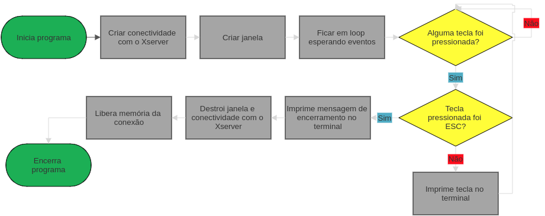

# Mini Library X

Então... basicamente a mlx é uma biblioteca gráfica para C, que permite que você crie coisas básicas como um wireframe, ou até [**DUKEfuckingNUKEM**](https://www.youtube.com/watch?v=46MALEk-7cE)😮... Mas, como  

> "Nem tudo que reluz é ouro." -Muita gente (-2022 - 2022)

Ela é documentada como todo jogo moderno sai... Uma bos-🤬. Mas não se preocupe, eu abrirei mão do meu tempo livre (e sanidade mental😵‍💫) pra te ajudar a destrinchar essa POR-🤬.

* [Fontes;](https://github.com/andreyvdl/MiniLibX_my_docs/blob/main/README.md#fontes)
* [Instalar;](https://github.com/andreyvdl/MiniLibX_my_docs/blob/main/README.md#instalar)
* [Básico;](https://github.com/andreyvdl/MiniLibX_my_docs/blob/main/README.md#basico)
* [Funções;](https://github.com/andreyvdl/MiniLibX_my_docs/blob/main/FUNCOES.md)

## Fontes

Não, não vou passar link de _[comic sans](https://youtu.be/wDgQdr8ZkTw)_ na verdade vou passar link de documentações feitas de forma séria, então caso você já tenha enjoado do meu texto... vaza, xispa daqui.   
* [harm-smits](https://harm-smits.github.io/42docs/libs/minilibx).   
* [Aurelien Brabant (brabo)](https://aurelienbrabant.fr/blog?tags=school+42).
* [Soraia Novaes](https://soraianovaes.notion.site/So-Long-c6d751eb784f46b8848a8cda5e3fdf4d).

## Instalar

Basicamente só segue o que tá escrito no [README](https://github.com/42Paris/minilibx-linux), a não ser que esteja no WSL, (aka Linux Subsistema do Windows) aí acho bom seguir esse [daqui](https://harm-smits.github.io/42docs/libs/minilibx/getting_started.html#getting-a-screen-on-windows-10-wsl2) (sinceramente fiz com [esse](https://github.com/codam-coding-college/MLX42#installation)).   
> "Ah Andrey, eu segui tudo direitinho mas não tenho essa `/usr/X11/lib` nem `/usr/X11/include` ou `/usr/X11/man/man3`"

CRIA.   
> "Ah mas Andrey, não é-"

**SÓ CRIA.**   
> "Mas não tenho permi-"

**`SUDO MKDIR`**   
> "Não consig-"

**`SUDO CP -RF`**   
Depois execute o shell de teste da mlx e torça pra dar tudo certo, porquê se algo der errado... boa sorte pra descobrir o que tá errado.

## Básico

Se tudo deu certo no teste, então tá na hora de por a mão na massa.   
Crie um arquivo que termine com `.c` (afinal todo arquivo de Clang é assim), e coloque o seguinte código:

```c
#include <stdio.h>
#include <stdlib.h>	
#include <mlx.h>

#define ESC 65307

typedef struct struct_ponteiros {
	void	*mlx;
	void	*janela;
}	tipo_ponteiros;

int	checa_teclas(int tecla, tipo_ponteiros *ponteiros) {
	if (tecla == ESC) {
		printf("Fechando a janela e encerrando o programa...\n");
		mlx_destroy_window(ponteiros->mlx, ponteiros->janela);
		mlx_destroy_display(ponteiros->mlx);
		free(ponteiros->mlx);
		exit(0);
	}
	else
		printf("Voce pressionou a tecla: %c\n", tecla);
	return (0);
}

int main() {
	tipo_ponteiros	ponteiros;
	void			*ponteiro_da_mlx;
	void			*ponteiro_da_janela;

	ponteiro_da_mlx = mlx_init();

	ponteiro_da_janela = mlx_new_window(ponteiro_da_mlx, 200, 200, "Janela");

	ponteiros.mlx = ponteiro_da_mlx;
	ponteiros.janela = ponteiro_da_janela;

	mlx_key_hook(ponteiros.janela, checa_teclas, &ponteiros);
	mlx_loop(ponteiro_da_mlx);
}
```

Compile ele com as seguintes flags: `-lmlx -lXext -lX11` e execute o binário (não se preocupe com o que cada flag e parte do código faz, explico depois), você agora deve ter uma janela com o título "Janela" com fundo preto, clique nela e pressione qualquer tecla do teclado, no terminal você verá uma mensagem, agora aperte a tecla `ESC`, mais uma mensagem vai aparecer no terminal e a janela vai sumir encerrando o programa (se você tentou fechar apertando o `X` no canto da janela, não se surpreenda por não funcionar, afinal ainda não programamos para isso).   
Agora vamos ver o fluxograma do programa para um melhor entendimento:   


Agora que você entendeu na prática e visualmente o que o programa faz, vamos falar na teoria.   
Nós criamos uma conexão entre nosso programa e o Xserver, depois criamos uma conexão entre nosso programa e uma janela gerada pelo Xserver, logo após dizemos para o Xserver ficar em loop esperando por eventos (como por exemplo, uma tecla ser pressionada), quando um evento acontece, o Xserver chama uma função que nós programamos, essa função recebe como parâmetro o código da tecla pressionada, e então nós verificamos se a tecla pressionada foi a `ESC`, se sim, nós encerramos o programa, se não, nós imprimimos a tecla pressionada no terminal.

Sobre as flags de compilação:   
`-lmlx` manda o compilador linkar com a biblioteca `mlx`, que nós compilamos e instalamos.   
`-lXext` manda o compilador linkar com a biblioteca `libxext-dev`, [libXext](https://packages.debian.org/sid/libxext-dev) fornece uma interface de cliente X Window System para diversas extensões para o protocolo X.   
`-lX11` manda o compilador linkar com a biblioteca `Xorg`, [X11](https://pt.wikipedia.org/wiki/X_Window_System) é um software de sistema e um protocolo que fornece uma base para interfaces gráficas de usuário (com o conceito de janelas) e funcionalidade rica de dispositivos de entrada para redes de computadores.

## FUNÇÕES

### mlx_clear_window

> Limpa a janela, removendo imagens, pixels e strings.   
> Recebe como parâmetros um ponteiro para a conexão com o **Xserver** e um ponteiro para a janela.   
> Não tem retorno.
```c
void	mlx_clear_window(void *mlx_ptr, void *win_ptr);
```

### mlx_destroy_display\*

> Encerra a conexão com o **Xserver**.   
> Recebe como parâmetro um ponteiro para a conexão com o **Xserver**.   
> Retorna `0` se a conexão foi encerrada com sucesso.
```c
int	mlx_destroy_display(void *mlx_ptr);
```
<sub>\* Essa função não dá free no ponteiro, então tome cuidado para não vazar memória.</sub>

### mlx_destroy_window\*

> Destroi a janela.   
> Recebe como parâmetros um ponteiro para a conexão com o **Xserver** e um ponteiro para a janela.   
> Retorna `1` se a janela foi destruída com sucesso.
```c
int	mlx_destroy_window(void *mlx_ptr, void *win_ptr);
```
<sub>\* Essa função dá free no ponteiro, então não se preocupe com vazamentos.</sub>

### mlx_init

> Inicializa a conexão com o **Xserver**.   
> Não tem parâmetros.   
> Retorna um ponteiro para a conexão criada.
```c
void	*mlx_init(void);
```

### mlx_new_window

> Inicializa uma janela.   
> Recebe como parâmetros um ponteiro para a conexão com o **Xserver**, o tamanho da janela em pixels (0 representa o canto superior esquerdo da tela, **width** avança para a direita e **height** avança para baixo) e o título da janela.   
> Retorna um ponteiro para a janela criada.
```c
void	*mlx_new_window(void *mlx_ptr, int width, int height, char *title);
```

# 🚧 WIP 🚧
